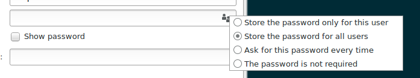

# nm-vpn-autoconnect
Simple script (with systemd service) to automatically reconnect a VPN via NetworkManager

In your VPN settings, make sure you have selected "All users may connect to this network", and, if there is a password, "Store the password for all users".

Edit `VPN_NAME` in `nm-vpn-autoconnect.sh` to correspond to your VPN UUID.

You can see the UUID in the output of `nmcli con`.

Then:

    sudo ./install.sh

If you have issues, you can disable the service:

    sudo systemctl stop nm-vpn-autoconnect
    sudo systemctl disable nm-vpn-autoconnect
